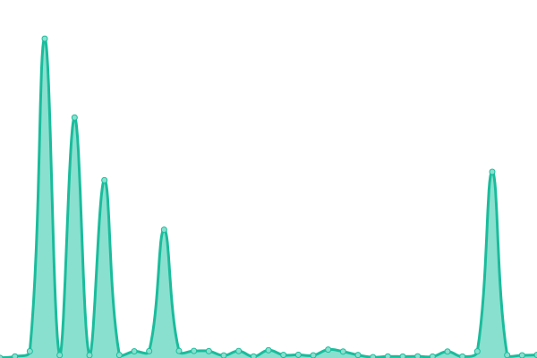

# [📈 Live Status](https://status.nest.land): <!--live status--> **🟨 Degraded performance**

This repository contains the open-source uptime monitor and status page for [nest.land](https://nest.land), powered by [Upptime](https://github.com/upptime/upptime).

With [Upptime](https://upptime.js.org), you can get your own unlimited and free uptime monitor and status page, powered entirely by a GitHub repository. We use [Issues](https://github.com/nestdotland/status/issues) as incident reports, [Actions](https://github.com/nestdotland/status/actions) as uptime monitors, and [Pages](https://status.nest.land) for the status page.

<!--start: status pages-->
<!-- This summary is generated by Upptime (https://github.com/upptime/upptime) -->
<!-- Do not edit this manually, your changes will be overwritten -->
<!-- prettier-ignore -->
| URL | Status | History | Response Time | Uptime |
| --- | ------ | ------- | ------------- | ------ |
|  [WEB](https://nest.land/package/std/files/flags/mod.ts) | 🟩 Up | [web.yml](https://github.com/nestdotland/status/commits/HEAD/history/web.yml) | 

 115ms
     
 | 

<a href="https://status.nest.land/history/web">100.00%</a>
    

|  [API](https://x.nest.land/api/package/std/0.75.0) | 🟩 Up | [api.yml](https://github.com/nestdotland/status/commits/HEAD/history/api.yml) | 

 129ms
     
 | 

<a href="https://status.nest.land/history/api">100.00%</a>
    

|  [CDN](https://x.nest.land/std@0.75.0/flags/mod.ts) | 🟩 Up | [cdn.yml](https://github.com/nestdotland/status/commits/HEAD/history/cdn.yml) | 

 1027ms
     
 | 

<a href="https://status.nest.land/history/cdn">100.00%</a>
    

|  [API (Staging)](https://api-dev.nest.land/imports/x/denoland/std/0.75.0) | 🟩 Up | [api-staging.yml](https://github.com/nestdotland/status/commits/HEAD/history/api-staging.yml) | 

 48ms
     
 | 

<a href="https://status.nest.land/history/api-staging">100.00%</a>
    

|  [CDN (Staging)](http://cdn-dev.nest.land/denoland/std@0.75.0/flags/mod.ts) | 🟨 Degraded | [cdn-staging.yml](https://github.com/nestdotland/status/commits/HEAD/history/cdn-staging.yml) | 

 306ms
     
 | 

<a href="https://status.nest.land/history/cdn-staging">99.95%</a>
    

|  [Arweave](https://y2dkomn4abqiffiuvhrfhuqynbu4det55c3uipi4gyvvntorwfoa.arweave.net/xoanMbwAYIKVFKniU9IYaGnBkn3ot0Q9HDYrVs3RsVw/flags/mod.ts) | 🟩 Up | [arweave.yml](https://github.com/nestdotland/status/commits/HEAD/history/arweave.yml) | 

 311ms
     
 | 

<a href="https://status.nest.land/history/arweave">100.00%</a>
    

<!--end: status pages-->

[**Visit our status website →**](https://status.nest.land)

## 📄 License

- Code: [MIT](./LICENSE) © [nest.land](https://nest.land)
- Data in the `./history` directory: [Open Database License](https://opendatacommons.org/licenses/odbl/1-0/)
